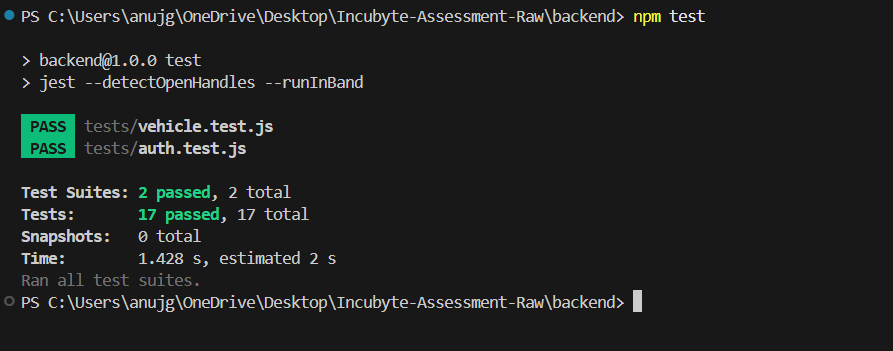

# Test Report

## Project

**Vehicle Inventory Management System**

---

## Testing Framework

- Jest
- Supertest
- Prisma ORM
- SQLite

---

## Test Environment

- Node.js
- Express.js
- Prisma ORM
- SQLite Database

---

## Command Executed

```bash
cd backend
npm test
```

---

## Test Execution Results

### Initial Test Run

During development, three backend tests failed due to:

- Admin role mismatch in the JWT token used by the test suite.
- Purchase endpoint ignoring the requested purchase quantity.
- Purchase service always decrementing inventory by one instead of the requested quantity.

These issues were identified, fixed, and verified before submission.

#### Initial Test Output


---

### Final Test Run

After fixing the authorization and purchase workflow issues, the complete backend test suite passed successfully.

```text
> backend@1.0.0 test
> jest --detectOpenHandles --runInBand

PASS  tests/vehicle.test.js
PASS  tests/auth.test.js

Test Suites: 2 passed, 2 total
Tests:       17 passed, 17 total
Snapshots:   0 total
Time:        1.428 s
Ran all test suites.
```

#### Final Test Output



---

## Test Coverage

### Authentication

- User Registration
- User Login
- JWT Authentication
- Password Hashing
- Authorization Validation

### Vehicle Inventory

- Create Vehicle
- Retrieve Vehicles
- Search Vehicles
- Update Vehicle
- Delete Vehicle
- Purchase Vehicle
- Restock Vehicle
- Role-Based Authorization
- Unauthorized Access Handling

---

## Summary

| Metric | Result |
| :----- | :----: |
| Test Suites | 2 |
| Passed Suites | 2 |
| Failed Suites | 0 |
| Total Tests | 17 |
| Passed Tests | 17 |
| Failed Tests | 0 |

---

## Conclusion

All automated backend tests passed successfully. The test suite validates the core functionality of the Vehicle Inventory Management System, including authentication, authorization, CRUD operations, vehicle search, purchasing, restocking, and inventory management workflows.

The successful execution of all **17 backend tests** demonstrates that the application behaves as expected and satisfies the implemented functional requirements.
